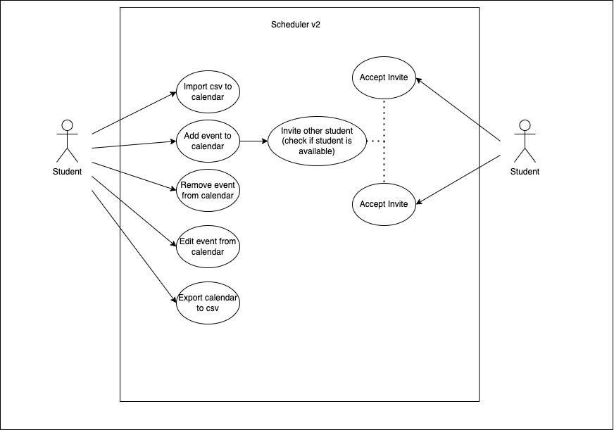
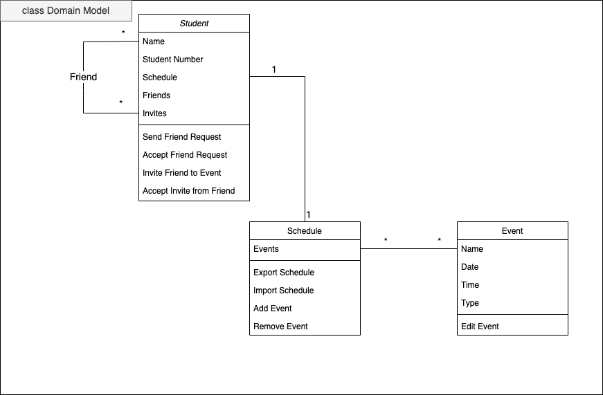

## Requirements

### Use case model 

 

  

### Use cases  

| Name | Add an event to the calendar |
|--- |--- |
| Actor | Student |
| Description | The Student adds an event to an  existing calendar. |
| Preconditions | The Student has access to the *uni* app. |
| Postconditions | The Student can now see the event on the calendar. |
| Normal flow | 1. The Student accesses his's schedule page on the *uni* app.  2. The Student presses the edit button. 3. A pop-up window opens up.  4. The Student selects the add function. 5. The Student selects between an UC or an extracurricular activity.   6. If the Student selects an UC, there is a drop-down box, that allows the Student to choose the course’s name, the classroom, and the time of the class.  |
| Alternative flow | 1. [Extracurricular] If in step 5 the Student selects "extracurricular", there is a drop-down box to add it. Writing the corresponding name, the time, the place and an optional adding friend button (to invite the Student_Friend to the extracurricular activity).   2. The Student_Friend will receive a notification with the request to attend the extracurricular activity.  3. There will be a circle in the Student’s schedule, indicating if the Student_Friend accepted the request (green accepted, red declined, yellow still waiting for an answer). |
 

| Name | Remove an event from the calendar |
|--- |--- |
| Actor | Student |
| Description | The Student removes an existing event from the calendar.|
| Preconditions | - The Student has access to the *uni* app.   - A removable event exists in the students' calendar.|
| Postconditions | The Student can no longer see the event in the calendar. |
| Normal flow | 1. The Student accesses his's schedule page on the *uni* app.  2. The Student presses the edit button. 3. It opens a pop-up window.  4. The Student selects the remove function. 5. The Student will choose the event type, name and day of the week, that he wants to remove. 6. The Student can press the button to submit the changes, and the event will immediately disappear from his’s schedule page.|
 

| Name | Edit an event on the calendar |
|--- |--- |
| Actor | Student |
| Description | The Student edits an event from an existing calendar. |
| Preconditions | - The Student has access to the *uni* app.   - An editable event exists in the students' calendar.|
| Postconditions | The Student can now see the edited event in the calendar. |
| Normal flow | 1. The Student accesses his’s schedule page on the *uni* app.  2. The Student taps and holds the event from the schedule that he wants to edit.   3. The event will zoom and then he can make the changes that he wants (name, type, time, and day).|
| Alternative flow | 1. [Remove and add] The Student can remove and add an event, in the same way that was explained before.  |
 

| Name | Export calendar to a .csv file |
|--- |--- |
| Actor | Student |
| Description | The Student exports the *uni* calendar to a .csv file. |
| Preconditions | The Student has access to the *uni* app. |
| Postconditions | The Student has access to the calendar in a .csv file. |
| Normal flow | 1. The Student accesses his’s schedule page on the *uni* app.   2. The Student can press the button to export the schedule into a .csv file.  3. It will open a window where the Student can choose where to export the .csv file.|
 

| Name | Import a .csv file onto the  calendar |
|--- |--- |
| Actor | Student |
| Description | The Student imports a .csv file to the *uni* calendar.|
| Preconditions | - The Student has access to the *uni* app   - The Student has a .csv file in a compatible format scheme.|
| Postconditions | The Student can now see the events from the .csv file on his's calendar.|
| Normal flow | 1. The Student accesses his’s schedule page on the *uni* app.  2. The Student can press the import .csv button, that opens the file browser of the Student’s device, so he can choose the file to import. |
| Alternative flow |  1. [Invalid file] If the file type is invalid or unformatted, an error message will appear, indicating the error type.|

### Domain model

 

  

