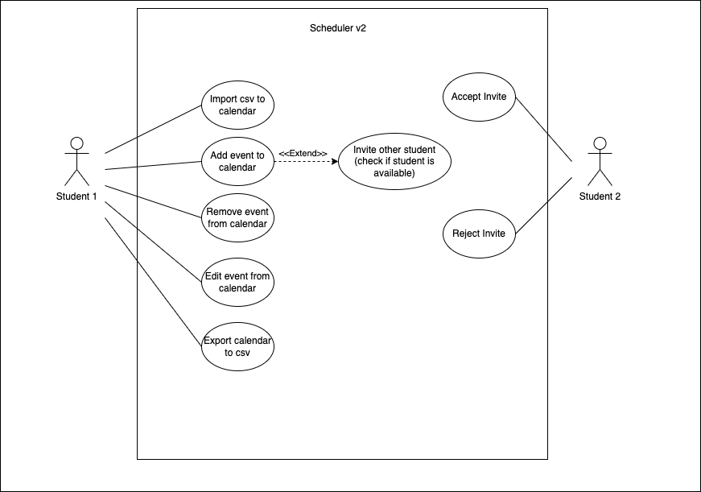

## Requirements

In this section, you should describe all kinds of requirements for your module: functional and non-functional requirements.

### Use case model 

 

  

### Use cases  

| Name | Add event to calendar |
|--- |--- |
| Actor | Student |
| Description | The Student adds an event to the existing calendar. |
| Preconditions | Student has access to the *uni* app. |
| Postconditions | Student can now see the event in the calendar. |
| Normal flow | 1. Student access the schedule page of Uni app.  2. Student presses the edit button. 3. It opens a pop up window.  4. Student selects the add function. 5. Student selects between UC or "extracurricular".   6. If the Student selects UC, there is a drop-down box, that allows the Student to choose the course name, the classroom, and the time of the class.  |
| Alternative flow | 1.["Extracurricular"] if in step 5 the Student selects "extracurricular", there is a drop-down box, that allows the Student to add it. Writing the corresponding name, the time, the place, and an adding friend button (to invite the Student_Friend to the "extracurricular").   2. The Student_Friend will receive a notification with the request to attend the "extracurricular" event.  3. There will be a circle in the Student schedule indicating if the Student_Friend accepted the request (green accepted, red declined, yellow still waiting the answer). |
 

| Name | Remove event from calendar |
|--- |--- |
| Actor | Student |
| Description | The Student removes an existing event to the calendar.|
| Preconditions | - Student has access to the *uni* app.   - A removable event exists in the students' calendar.|
| Postconditions | Student can no longer see the event in the calendar. |
| Normal flow | 1. Student access the schedule page of Uni app.  2. Student presses the edit button. 3. It opens a pop up window.  4. Student selects the remove function. 5. Student will choose the event type, name and day of the week, that he wants to remove. 6. After that, the Student can press the button to submit the changes, and it will immediately disappear from the schedule page.|
 

| Name | Edit event from calendar |
|--- |--- |
| Actor | Student |
| Description | The Student edits an event to the exising calendar. |
| Preconditions | - Student has access to the *uni* app.   - An editable event exists in the students' calendar.|
| Postconditions | Student can now see the edited event in the calendar. |
| Normal flow | 1. Student access the schedule page of Uni app.  2. Student can hold the event from the schedule that he wants to edit.   3. The event will zoom and then he can make the changes that he wants (name, type, time, and day).|
| Alternative flow | 1. [Remove and add] Student can just remove and add a new event, in the same way that was explained before.  |
 

| Name | Export calendar to .csv |
|--- |--- |
| Actor | Student |
| Description | The Student exports the *uni* calendar to a .csv file. |
| Preconditions | Student has access to the *uni* app. |
| Postconditions | Student has access to the calendar in a .csv file. |
| Normal flow | 1. Student access the schedule page of Uni app.   2. Student can press the button to export the schedule file.  3. It will open a window where the Student can choose where to register the .csv schedule file.|
 

| Name | Import .csv to calendar |
|--- |--- |
| Actor | Student |
| Description | The Student imports a .csv file to the *uni* calendar.|
| Preconditions | - Student has access to the *uni* app   - Student has a .csv file in the accepted scheme.|
| Postconditions | Student can now see the events from the .csv in the calendar.|
| Normal flow | 1. Student access the schedule page of Uni app.  2. Student can press an import .csv button, that access the file browser of the Student, so he can choose the file to import. |
| Alternative flow |  1. [Invalid file] if the file type is invalid or unformatted, it will appear a error message indicatin the error type.|

### User stories
The user stories should be created as GitHub issues. Therefore, this section will *not* exist in your report, it is here only to explain how you should describe the requirements of the product as **user stories**. 

A user story is a description of desired functionality told from the perspective of the user or customer. A starting template for the description of a user story is 

*As a < user role >, I want < goal > so that < reason >.*

User stories should be created and described as [Issues](https://github.com/LEIC-ES-2021-22/templates/issues) in GitHub with the label "user story". See how to in the video [Creating a Product Backlog of User Stories for Agile Development using GitHub](https://www.youtube.com/watch?v=m8ZxTHSKSKE).

You should name the issue with the text of the user story, and, in the "comments" field, add any relevant notes, the image(s) of the user interface mockup(s) (see below) and the acceptance test scenarios (see below). 

**INVEST in good user stories**. 
You may add more details after, but the shorter and complete, the better. In order to decide if the user story is good, please follow the [INVEST guidelines](https://xp123.com/articles/invest-in-good-stories-and-smart-tasks/).

**User interface mockups**.
After the user story text, you should add a draft of the corresponding user interfaces, a simple mockup or draft, if applicable.

**Acceptance tests**.
For each user story you should write also the acceptance tests (textually in [Gherkin](https://cucumber.io/docs/gherkin/reference/)), i.e., a description of scenarios (situations) that will help to confirm that the system satisfies the requirements addressed by the user story.

**Value and effort**.
At the end, it is good to add a rough indication of the value of the user story to the customers (e.g. [MoSCoW](https://en.wikipedia.org/wiki/MoSCoW_method) method) and the team should add an estimation of the effort to implement it, for example, using t-shirt sizes (XS, S, M, L, XL).

### Domain model

To better understand the context of the software system, it is very useful to have a simple UML class diagram with all the key concepts (names, attributes) and relationships involved of the problem domain addressed by your module. 
Also provide a short textual description of each class. 

Example:
 

  

